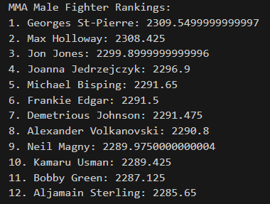
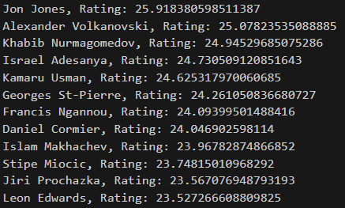

# mma-fighter-ranking
rudimentary python scripts for ranking MMA fighters with different algorithms, both get differing results that aren't what a real top list would look like, but it gets close with a lot of big name showing up

# Script 1 :
Uses ELO, (incomplete) autocorrelation and then uses a composite score based off of ELO, significant strike differential, takedown differential, and method of  victory. 

# Script 2:
Uses a mixed score from RandomForestClassifier and TrueSkill rating with Optuna hyperparameter tuning.

# Database source:
https://www.kaggle.com/datasets/akshaysinghim/ufc-fight-data-1993-to-2023
